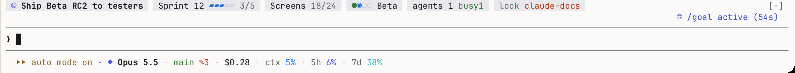
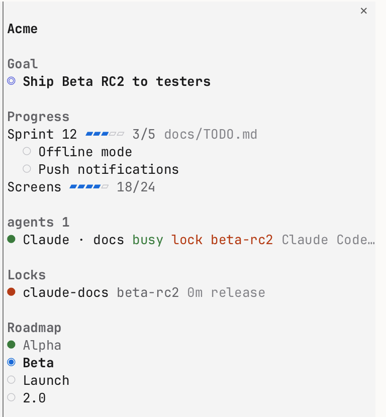

[English](README.md) | 简体中文

# waypoint

在 Claude Code 输入框上方用一行显示项目进度。以 [Claude Code mod](https://code.claude.com/docs/en/plugins/mods/overview) 形式编写。



每一项是一个苹果系统色的浅色胶囊，跟随 Claude Code 的明暗主题。宽度不够时，最不重要的胶囊先让位。`/waypoint` 打开详情窗格：未完成的清单项、全部阶段、每个 agent 的状态和它持有的锁。



> **需要 Claude Code 2.1.289 或更新版本。** mod 是早期访问 API，版本之间可能变化。如果更新后不显示了，请提 issue。

## 安装

在 Claude Code 里：

```
/plugin marketplace add VibeMage/claude-mod-waypoint
/plugin install waypoint@claude-mod-waypoint
```

装好立即显示。不用配置也能用：会显示 `/goal`、Claude 的任务清单、第一个带勾选框的 `TODO.md`，以及 `ROADMAP.md` 里的阶段表。想精确跟踪某些内容，再加一个配置文件。

## 能显示什么

| 胶囊 | 含义 | 来源 |
| --- | --- | --- |
| ◎ 目标 | 当前会话的 `/goal`，Claude Code 判定达成后变成 ✓，旁边是任务完成数 | 会话记录（`goal_status`、`/goal`） |
| ▸ 任务 | 没有 goal 时：完成数/总数和正在做的那项 | TodoWrite 和 Task 工具 |
| 勾选清单 | Markdown 文件某一节里的 `- [x]` / `- [ ]`，带进度条 | 任意 `.md` 文件 |
| 计数 | 手动维护的数字，或某个命令输出的 `完成/总数` | 配置 |
| ●◉○ 路线图 | 每个阶段一个点：已完成、当前、未开始 | 带“阶段”列和“状态”列的 Markdown 表格 |
| Epic | beads epic 的已关闭/全部子任务 | `bd epic status --json`，最多每 5 分钟一次 |
| 里程碑 | GitHub milestone 的已关闭/全部 issue | `gh api`，最多每 5 分钟一次，配置后才启用 |
| 团队 | 在同一项目上工作的 Claude Code 和 Codex 窗格：忙、待批、卡住（限流、模型满载） | [Otty](https://otty.sh) 里目录是本项目或其 git worktree 的窗格 |
| 锁 | 谁持有锁文件、在做哪个任务 | 配置 |

## 配置

waypoint 依次查找：

1. 项目里的 `.claude/waypoint.json`，内容是一个项目对象；
2. `~/.claude/waypoint.json`，格式为 `{ "projects": [ { "paths": ["~/code/app"], ... } ] }`，适合不想改动仓库的项目。

```json
{
  "name": "My App",
  "checklists": [{ "file": "docs/TODO.md", "marker": "本迭代" }],
  "roadmap": { "file": "docs/ROADMAP.md", "current": "Beta" },
  "counters": [{ "label": "页面", "done": 12, "total": 30 }],
  "beads": { "epic": "app-12" },
  "github": { "milestone": "v1.0" },
  "team": { "panes": { "p_1a2b3c_4": "Codex A" } },
  "locks": [{ "path": ".local/deploy.lock", "label": "部署", "worktrees": true }],
  "panes": ["p_1a2b3c_3"]
}
```

| 字段 | 含义 |
| --- | --- |
| `name` | 窗格里显示的项目名 |
| `root` | 相对路径的基准目录（默认是仓库根目录） |
| `paths` | 仅全局配置：这一项适用于哪些目录 |
| `panes` | 只在这些 Otty 窗格（`p_…`）里显示这一行；详情窗格在哪里都能打开 |
| `checklists[]` | `file`，再指定哪一节：`section`（标题包含这段文字），或 `marker`（**最后一个**包含它的标题，适合每批新任务追加在文件末尾的写法），都没有则取第一个还有未完成项的节。`label` 覆盖从标题取的名字。只统计顶格的条目，缩进的算子步骤 |
| `roadmap` | `file`，可选 `current`（当前阶段名的开头），或 `false` |
| `counters[]` | `label` 加 `done` 和 `total`，或 `command`（在根目录运行的 argv 数组，输出里要有 `完成/总数`） |
| `beads` | `true`、`false` 或 `{ "epic": "<id>" }`。根目录有 `.beads/` 时默认开启 |
| `github` | `true` 或 `{ "milestone": "<标题>" }`。默认关闭 |
| `team` | `false`；或 `{ "panes": { "<窗格 id>": "<名字>" } }` 精确指定窗格；或 `{ "cwds": [...], "agents": ["Codex"], "stuck": ["表示卡住的文字"] }` 调整自动识别范围 |
| `locks[]` | `path`（一个文件，或内含 `owner.json` 的目录）、`label`，`worktrees: true` 表示在每个 git worktree 里都找。持有者读 `actor`、`owner`、`holder` 或 `user`，任务读 `task` 或 `issue` |

设置（`/config` › waypoint）：语言（`auto`、`en`、`zh`）、样式（`capsule` 胶囊或 `plain` 纯文字）、刷新间隔（默认 20 秒）、是否显示团队。

## 命令

- `/waypoint`：打开或关闭详情窗格
- `/waypoint refresh`：立即重新读取
- `/waypoint config`：查看正在使用哪个配置文件

## waypoint 运行和读取什么

waypoint 是一个在 Claude Code mod 沙盒里运行的 TypeScript 模块，没有依赖，不下载任何东西，不写任何文件。

- **读取**：配置里指定的 Markdown 文件和锁文件（没有配置时读 `TODO.md` / `ROADMAP.md`）、配置文件本身、当前会话记录（只看 `/goal` 记录和任务工具调用）、Claude Code 的 `theme` 设置。
- **运行**：每次刷新运行 `git worktree list`，用 `grep` 在会话记录里找 `/goal` 记录；有 Otty 时运行 `otty pane list`，并对显示的 agent 窗格运行 `otty pane capture --lines 12`，用来区分忙、卡住和待批。最多每 5 分钟一次：开启 beads 时运行 `bd epic status`，配置了 GitHub 时运行 `gh api` 读里程碑（唯一的网络请求，由你自己的 `gh` 发出）。另外还有你给计数配置的 `command`。
- **钩子**：`tool.call` 只挂在 TodoWrite、TaskCreate 和 TaskUpdate 上，用来读取 Claude 写下的任务清单，调用本身原样放行。另外挂了 `session.start`（注册 `/waypoint` 并启动定时刷新）、`turn.complete`（每轮结束后刷新）、`/clear` 时的 `session.end`（清掉目标和任务），并用 `ui.render` 画出那一行和详情窗格。
- 会话记录不在常规路径时，每个会话运行一次 `find`，在 `~/.claude/projects` 下找到它。
- **从不**往其他窗格输入、修改任务跟踪器或编辑文件。

见 [PRIVACY.md](PRIVACY.md)。

## 开发

```sh
claude --plugin-dir .          # 在一个会话里加载，保存文件即重新加载
claude plugin validate .
claude plugin test .
```

## 许可证

MIT
